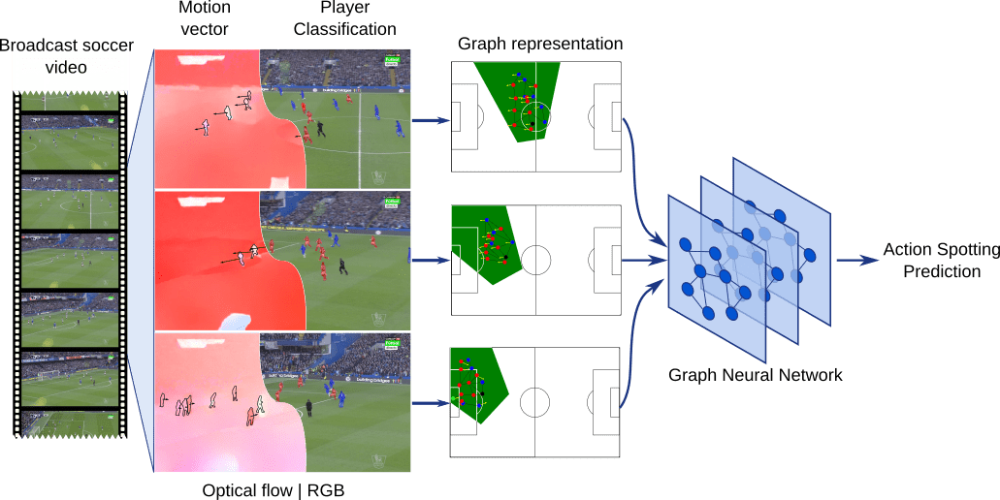

# Soccer Action Spotting

This repository contains the code for video action spotting for soccer videos.



The repository includes:
* Source code for audio, video, and graph model
* Training/testing code for SoccerNet-V2
* Jupyter notebooks for visualizing results

The code is documented and designed to be easy to extend. If you use it in your research, please consider citing this repository (bibtex below).

## Citation

The paper is available as an [arXiv report](https://arxiv.org/abs/2211.12334). If you use this code, please cite the following paper:

Alejandro Cartas, Coloma Ballester, and Gloria Haro. "A Graph-Based Method for Soccer Action Spotting Using Unsupervised Player Classification" ACM MMSports Workshop (2022).

```
@inproceedings{cartas2022GraphActionSpotting,
author = {Cartas, Alejandro and Ballester, Coloma and Haro, Gloria},
title = {A Graph-Based Method for Soccer Action Spotting Using Unsupervised Player Classification},
publisher = {Association for Computing Machinery},
address = {New York, NY, USA},
booktitle = {Proceedings of the 5th International ACM Workshop on Multimedia Content Analysis in Sports},
series = {MMSports '22}
pages = {93–102},
location = {Lisboa, Portugal},
year = {2022},
}
```

## Requirements
Python 3.7, PyTorch 1.8.1, and other common packages listed in `environment.yml`. (A Conda environment can be created from it following the instructions below.)

### SoccerNet-V2 Requirements:

To train or test on SoccerNet-V2, you'll also need:
* [SoccerNet-V2 Dataset](https://soccer-net.org/)
* VGG-11 Audio features extracted by [Bastien Vanderplaetse and Stéphane Dupont](https://github.com/bastienvanderplaetse/SoccerNetMultimodalActionSpotting). *NOTE: these can be extracted by following the instructions inside the features directory.* 

## Setup

1. Clone this repository:

```shell
git clone https://github.com/IPCV/soccer_action_spotting
```

2. Create and initialize a conda environment:

```shell
cd soccer_action_spotting
conda env create --name soccer --file environment.yml
conda activate soccer
```

3. Link the SoccerNetV2 dataset inside the `datasets` directory:

```shell
mkdir datasets && cd $_
ln -s /path/to/soccernet soccernet
```

4. Follow the instructions of the README.md file in the features directory to create the CSV files.

## Training/Testing

After activating the conda environment described in the setup section, type the configuration to train:

```shell
python main.py config/configuration.json
```

or for only testing an already trained model:

```shell
python main.py --test_only config/configuration.json
```

For instance, for training the audio baseline:

```shell
python main.py config/comparison/audio_stream_pooling.json
```

Full documentation of the training/testing code `main.py`:

```
usage: main.py [-h] [-d DATASET_PATH]
               [--split_train TRAIN_SPLITS [TRAIN_SPLITS ...]]
               [--split_valid VALIDATION_SPLITS [VALIDATION_SPLITS ...]]
               [--split_test TEST_SPLITS [TEST_SPLITS ...]]
               [--max_num_workers MAX_NUM_WORKERS]
               [--evaluation_frequency EVALUATION_FREQUENCY]
               [--weights_dir WEIGHTS_DIR] [--weights WEIGHTS] [--GPU GPU]
               [--log_config LOG_CONFIG] [--test_only]
               [--test_batch_size TEST_BATCH_SIZE] [--tiny TINY] [--no_cache]
               [--overwrite_cache]
               conf

Multi-modal action spotting implementation

positional arguments:
  conf                  JSON model configuration filepath

optional arguments:
  -h, --help            show this help message and exit
  -d DATASET_PATH, --dataset_path DATASET_PATH
                        Path for SoccerNet dataset (default: data/soccernet)
  --split_train TRAIN_SPLITS [TRAIN_SPLITS ...]
                        list of splits for training (default: [train])
  --split_valid VALIDATION_SPLITS [VALIDATION_SPLITS ...]
                        list of splits for validation (default: [valid])
  --split_test TEST_SPLITS [TEST_SPLITS ...]
                        list of split for testing (default: [test])
  --max_num_workers MAX_NUM_WORKERS
                        number of worker to load data (default: 4)
  --evaluation_frequency EVALUATION_FREQUENCY
                        Evaluation frequency in number of epochs (default: 10)
  --weights_dir WEIGHTS_DIR
                        Path for weights saving directory (default: weights)
  --weights WEIGHTS     Weights to load (default: None)
  --GPU GPU             ID of the GPU to use (default: -1)
  --log_config LOG_CONFIG
                        Logging configuration file (default:
                        config/log_config.yml)
  --test_only           Perform testing only (default: False)
  --test_batch_size TEST_BATCH_SIZE
                        Batch size for testing (default: 256)
  --tiny TINY           Consider smaller amount of games (default: None)
  --no_cache            Don't use cached data (default: False)
  --overwrite_cache     Overwrite cached data (default: False)
```

## Data

The annotated data corresponds to the second half of the match *england_epl/2014-2015/2015-02-21 - 18-00 Chelsea 1 - 1 Burnley*. The data can be downloaded from [here](https://drive.google.com/file/d/1D5YUORpFp_LzreEpcMU2rfcS2x7YDJIF/view?usp=sharing).
